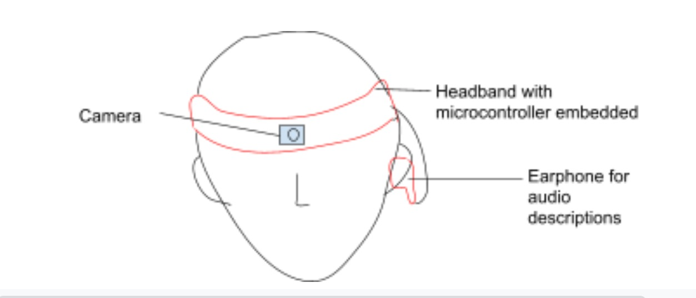
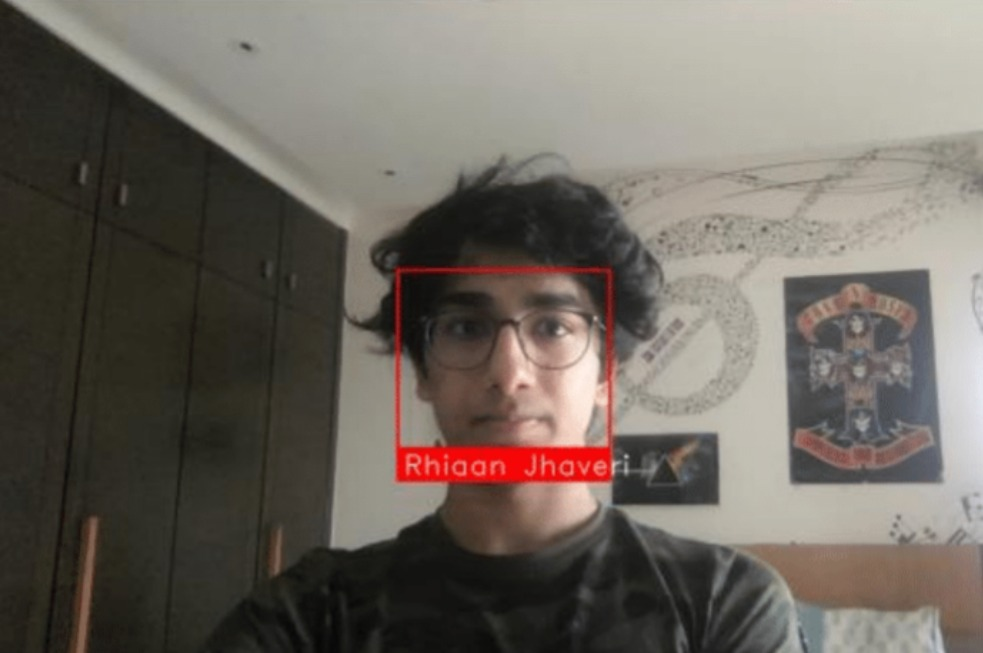

## Abstract

### **Problem Statement**

To design a device to enable blind people who speak Hindi to recognize who is around them and the basic details of their surroundings, without them having to ask many questions or having someone else describe their surroundings every time

### **Who is this affecting?**

My Neighbour, who is visually impaired and old

### __Solution Brainstorming__

1. An easily wearable device that recognizes common faces and basic surrounding objects, and describes these to the wearer through audio in Hindi. A RaspberryPi Camera could be used for a video feed, which is run through an ML program in the Raspberry Pi-such as this-to detect objects and faces of known people.A headband or cap was chosen since it is an attire suitable for walking.These could also possibly be integrated into glasses that he already wears

2. A Remote-like device with differently-textured buttons that when pressed, have different functions such as detecting the distance to the nearest object (possibly using ultrasonic sensors), recognizing faces when pointed, and alerting for assistance

### **Solution Finalisation**
I decided to stick with the first solution. The basic idea is of a cap with a raspberry Pi attached to it, and a raspberry pi camera at the front. For now, it would have to be powered by a power bank attached by a wire, and the power-bank would need to be in the wearer's pocket. Recognising a face, the program would then play a pre-recorded audio file with the associated name.

### **Prototyping**
I first experimented with the face recognition library on my computer using the [face recognition code](https://github.com/ageitgey/face_recognition). Combined with OpenCV, it could detect and distinguish my face in real time, with a name on the textbox, albeit slightly laggy.

Next, I tried to prototype the hardware. I found that using screws to attach the Pi board to the cap was effective, held it firmly in place, and used minimal material. However, atthis point, I found that the default Raspberry pi camera was causing complications in the program due to compatibility with openCV. Thus I decided to opt for a USB camera

### **Prototype Image**

### Project by
Rhiaan Jhaveri
